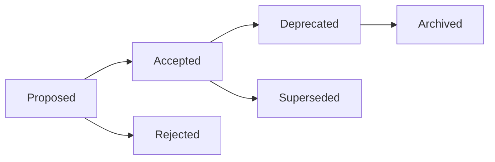

# Architecture Decision Records (ADRs)

Architecture Decision Records capture important architectural decisions made during the development of Cosmic Explorer. Each ADR explains the context, decision, and consequences of significant technical choices.

## What is an ADR?

An ADR is a document that captures an important architectural decision made along with its context and consequences. ADRs help:
- Future developers understand why decisions were made
- Avoid revisiting the same discussions
- Track the evolution of the architecture
- Onboard new team members effectively

## ADR Index

| ADR | Title | Status | Date | Summary |
|-----|-------|--------|------|---------|
| [[001-web-based-ui]] | Web-Based UI Over Terminal | Accepted | 2025-01 | Deprecated terminal interface in favor of web UI |
| [[002-websocket-communication]] | WebSocket for Real-time Updates | Accepted | 2025-01 | Use WebSocket for game state synchronization |
| [[003-file-based-saves]] | File-Based Save System | Accepted | 2025-02 | JSON files instead of database for saves |
| [[004-client-side-rendering]] | Client-Side Canvas Rendering | Accepted | 2025-02 | Render game visuals on client, not server |

## ADR Template

Use the [[_templates/adr-template|ADR Template]] when creating new ADRs. The template includes:
- Status (Proposed/Accepted/Deprecated/Superseded)
- Context explaining the problem
- Decision describing the solution
- Consequences (positive, negative, neutral)
- Alternatives considered
- Implementation notes

## ADR Process

### Creating a New ADR
1. Copy the [[_templates/adr-template|template]]
2. Number it sequentially (ADR-XXX)
3. Fill in all sections thoughtfully
4. Submit for review if needed
5. Update status when decision is final

### ADR Lifecycle

### When to Write an ADR
Write an ADR when:
- ✅ Choosing between different architectural approaches
- ✅ Making decisions with long-term impact
- ✅ Selecting key technologies or frameworks
- ✅ Changing fundamental design patterns
- ✅ Decisions that affect multiple components

Don't write an ADR for:
- ❌ Small implementation details
- ❌ Temporary workarounds
- ❌ Style or formatting choices
- ❌ Bug fixes (unless architectural)

## Categories

### Frontend Architecture
- [[001-web-based-ui|ADR-001: Web-Based UI]]
- [[004-client-side-rendering|ADR-004: Client-Side Rendering]]

### Communication & Networking
- [[002-websocket-communication|ADR-002: WebSocket Communication]]

### Data Persistence
- [[003-file-based-saves|ADR-003: File-Based Saves]]

### Game Systems
- (No ADRs yet - game mechanics evolved organically)

## Best Practices

### Writing Good ADRs
1. **Be Specific**: Include concrete examples
2. **Consider Alternatives**: Document why other options were rejected
3. **Think Long-term**: Consider future implications
4. **Stay Neutral**: Present facts, not opinions
5. **Include Context**: Future readers need background

### Reviewing ADRs
- Does it clearly explain the problem?
- Are all reasonable alternatives considered?
- Are consequences realistically assessed?
- Is the decision well-justified?
- Will this be clear in 2 years?

## Related Documentation

- [[architecture/overview|Architecture Overview]]
- [[guides/development/architecture-guide|Architecture Guide]]
- [[_templates/adr-template|ADR Template]]
- [ADR GitHub Repository](https://adr.github.io/) (external)

---

Parent: [[architecture/index|Architecture]] | [[README|Documentation Hub]]
