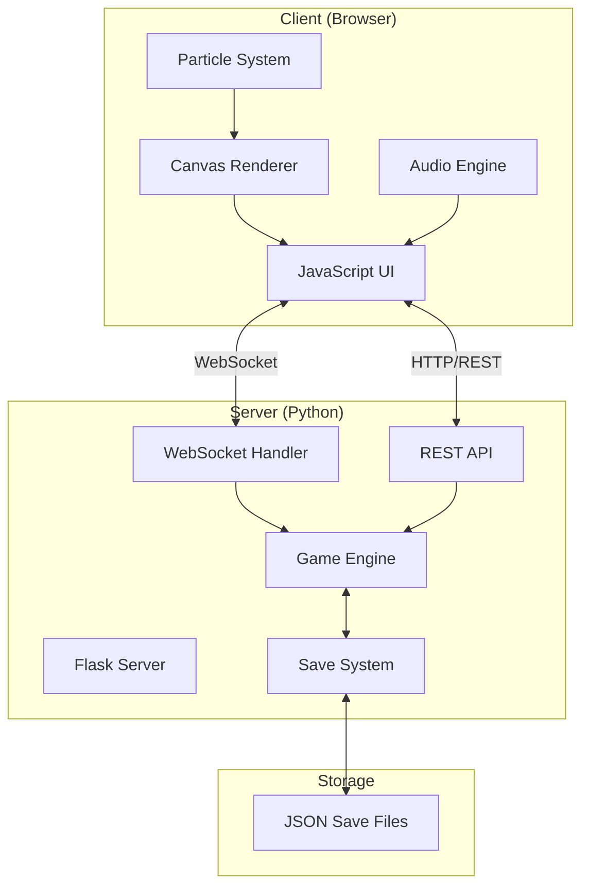
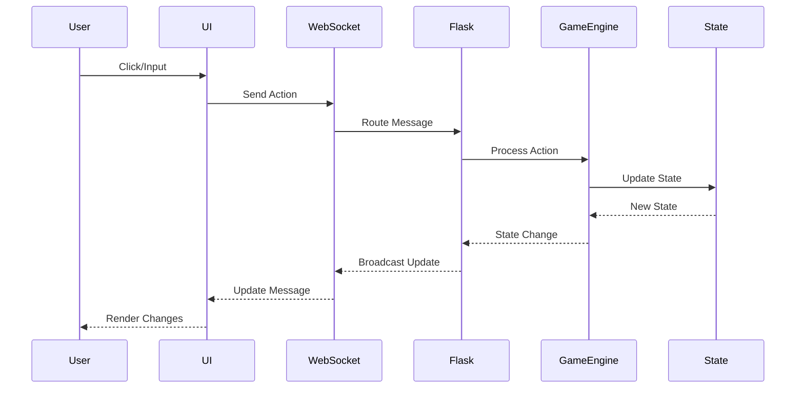

# Cosmic Explorer System Architecture

## Overview

Cosmic Explorer is a space exploration game built with a modern web architecture, featuring a Python backend game engine and a JavaScript frontend with real-time WebSocket communication.

### Key Architectural Principles
- **Separation of Concerns**: Clear boundaries between game logic, API, and UI
- **Real-time Synchronization**: WebSocket-based state updates
- **Stateless REST API**: For non-real-time operations
- **Client-side Rendering**: Canvas-based 60 FPS rendering engine
- **File-based Persistence**: JSON save files for simplicity

## System Architecture



## Component Architecture

### Backend Components

#### Core Game Engine (`/game.py`)
The heart of the game logic, managing:
- Game state and player statistics
- Turn-based action processing
- Event generation and handling
- Combat resolution
- Resource management

Related: [[components/backend/game-engine]]

#### API Layer (`/api/`)
Flask-based server providing:
- RESTful endpoints for game actions
- WebSocket support for real-time updates
- Session management
- CORS handling for web clients

Key files:
- `api/app.py` - Main Flask application
- `api/action_processor.py` - Game action handling
- `api/session_manager.py` - Player session tracking

Related: [[references/api/index]]

#### Game Systems
- **Regions & Navigation** (`regions.py`, `navigation.py`)
  - Procedural region generation
  - Movement and pathfinding
  - Location discovery
  
- **Events System** (`events.py`)
  - Random encounter generation
  - Event probability calculations
  - Outcome processing

- **Save System** (`save_manager.py`)
  - Game state serialization
  - Multiple save slots
  - Auto-save functionality

Related: [[components/game-systems/index]]

### Frontend Components

#### Rendering Engine (`static/js/renderer.js`)
Canvas-based rendering system featuring:
- 60 FPS game loop using requestAnimationFrame
- Sprite rendering and animation
- Background parallax effects
- Efficient draw call batching

Related: [[components/frontend/rendering-engine]]

#### UI System (`static/js/ui.js`)
Comprehensive interface management:
- HUD display with real-time stats
- Modal dialog system
- Inventory and equipment screens
- Quest and achievement tracking

Related: [[components/frontend/ui-system]]

#### Effects Systems
- **Particle System** (`static/js/particles.js`)
  - Object pooling for performance
  - Multiple effect types (explosions, thrust, healing)
  - Configurable particle behaviors

- **Audio Engine** (`static/js/audio.js`)
  - Procedural music generation
  - Sound effect management
  - Volume control and audio pooling

Related: [[components/frontend/audio-system]]

## Data Flow Architecture

### Game Action Flow


### Communication Protocol

#### Client → Server Messages
```javascript
{
  "event": "game_action",
  "data": {
    "action": "navigate",
    "target": 0,
    "params": {}
  }
}
```

#### Server → Client Updates
```javascript
{
  "event": "game_update",
  "data": {
    "player": { /* player stats */ },
    "current_region": { /* region data */ },
    "inventory": [ /* items */ ],
    "quests": [ /* active quests */ ],
    "timestamp": "2025-06-10T12:00:00Z"
  }
}
```

## Performance Architecture

### Frontend Optimizations
- **Canvas Rendering**: Hardware-accelerated 2D context
- **Object Pooling**: Reusable particle and effect objects
- **Sprite Batching**: Minimized draw calls
- **Lazy Loading**: On-demand resource loading

### Backend Optimizations
- **Lightweight Server**: Flask with eventlet for async support
- **Efficient Serialization**: Optimized JSON encoding
- **Stateless Design**: No server-side session storage
- **File-based Saves**: Simple, portable persistence

## Security Architecture

### Input Validation
- All API endpoints validate input parameters
- WebSocket messages sanitized before processing
- File paths restricted to save directory

### Access Control
- Environment-based configuration
- No direct filesystem access from client
- Safe JSON serialization practices

### Communication Security
- WebSocket origin validation
- CORS configuration for API endpoints
- No sensitive data in client code

## Deployment Architecture

### Development Environment
```bash
# Backend
python api/app.py

# Frontend
# Served by Flask in development
```

### Production Considerations
- Single Flask application serves both API and static files
- WebSocket support required (eventlet/gevent)
- Reverse proxy recommended (nginx/Apache)
- Static file caching for assets

Related: [[guides/deployment/index]]

## Extension Architecture

### Adding New Features

1. **Game Mechanics**
   - Extend game engine in Python
   - Add action processors
   - Update state serialization

2. **Visual Effects**
   - Extend particle system
   - Add new renderer components
   - Create animation sequences

3. **UI Components**
   - Add modal dialogs
   - Extend HUD elements
   - Create new screens

### Plugin System (Planned)
Future architecture for community content:
- Custom regions and events
- New ship types and equipment
- Additional augmentations
- Community-created quests

Related: [[references/roadmap#plugin-system]]

## Architecture Decision Records

Key architectural decisions are documented in ADRs:
- [[architecture/adrs/001-web-based-ui]] - Choosing web over terminal UI
- [[architecture/adrs/002-websocket-communication]] - Real-time updates
- [[architecture/adrs/003-file-based-saves]] - Save system design
- [[architecture/adrs/004-client-side-rendering]] - Canvas rendering

## Related Documentation

- [[components/backend/index|Backend Components]]
- [[components/frontend/index|Frontend Architecture]]
- [[references/api/index|API Reference]]
- [[guides/development/architecture-guide|Architecture Guide]]

---

Parent: [[README|Documentation Hub]]
