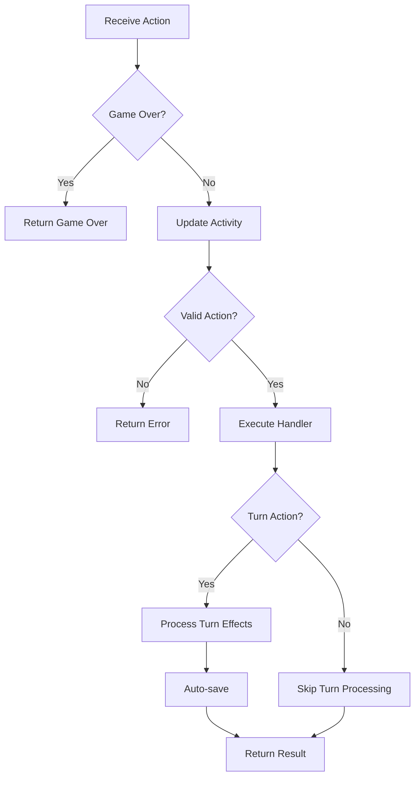

# Action Processor

The central game logic processor that handles all player actions and game events in Cosmic Explorer.

## 🎯 Overview

The Action Processor is the brain of the game, responsible for:
- Processing all player actions
- Validating game rules
- Updating game state
- Generating events and outcomes
- Managing turn-based mechanics
- Triggering auto-saves

## 🏗️ Architecture

### Class Structure

```python
class ActionProcessor:
    def __init__(self):
        self.combat_manager = CombatManager()
        self.action_handlers = {
            "navigate": self.handle_navigate,
            "event": self.handle_random_event,
            "repair": self.handle_repair,
            "buy_ship": self.handle_buy_ship,
            "buy_mod": self.handle_buy_mod,
            "combat": self.handle_combat,
            # ... more handlers
        }
```

### Action Handler Pattern
Each action has a dedicated handler method that:
1. Validates preconditions
2. Executes game logic
3. Updates player state
4. Returns formatted result

## 🎮 Available Actions

### Navigation Actions

#### Navigate
```python
{
    "action": "navigate",
    "target_node_id": "node_123",    # Optional
    "target_region_id": "region_456"  # Optional
}
```
- Moves player between locations
- Consumes fuel based on ship efficiency
- Triggers random encounters
- Updates turn count
- Auto-saves progress

#### Scan
```python
{"action": "scan"}
```
- Reveals hidden information (not yet implemented)
- Uses scanner equipment

### Resource Actions

#### Mine
```python
{"action": "mine"}
```
- Requires Mining Laser equipment
- Must be at asteroid field
- Consumes 5 fuel
- 70% success rate
- Yields rare minerals
- Chance for bonus items

#### Salvage
```python
{"action": "salvage"}
```
- Requires Salvager equipment
- Available after combat or at debris fields
- Consumes 3 fuel
- 80% success rate
- Yields various components

#### Consume Food
```python
{
    "action": "consume_food",
    "amount": 10  # Default: 10
}
```
- Restores health (2 HP per food)
- Limited by max health

### Economy Actions

#### Repair Ship
```python
{"action": "repair"}
```
- Must be at repair location
- Costs 100 credits
- Restores ship to max HP

#### Buy Ship
```python
{
    "action": "buy_ship",
    "ship_type": "scout"  # scout/trader/fighter/cruiser
}
```
- Must be at repair location
- Replaces current ship
- Exits pod mode if active

#### Buy Modification
```python
{
    "action": "buy_mod",
    "mod_id": "shield_booster"
}
```
- Must be at repair location
- Installs ship modification
- Limited by slot availability

#### Sell Item
```python
{
    "action": "sell_item",
    "item_id": "rare_minerals",
    "quantity": 5
}
```
- Must be at trading location
- Price varies by location type
- Trading posts offer 20% bonus

### Pod Actions

#### Buy Pod
```python
{"action": "buy_pod"}
```
- Costs 500 credits
- One-time purchase
- Enables emergency escape

#### Buy Augmentation
```python
{
    "action": "buy_augmentation",
    "augmentation_id": "shield_matrix"
}
```
- Must have pod
- Must be at repair location
- Provides ship bonuses
- Lost when pod is used

### Combat Actions

#### Initiate Combat
```python
{"action": "combat"}
```
- Starts combat encounter
- Based on location danger

#### Combat Action
```python
{
    "action": "combat_action",
    "combat_action": "attack"  # attack/special/heal
}
```
- Processes combat turn
- Updates combat state

#### Flee
```python
{"action": "flee"}
```
- Attempts to escape combat
- Success based on ship speed

#### Negotiate
```python
{"action": "negotiate"}
```
- Attempts peaceful resolution
- Costs credits if successful

## 🔄 Action Processing Flow



## 🎯 Game Over Conditions

The processor checks these conditions before every action:

### Defeat Conditions
- **Health <= 0**: Player dies
- **Ship destroyed**: Without escape pod
- **Pod destroyed**: While in pod mode
- **Out of fuel**: Stranded in space
- **Turn limit**: MAX_TURNS reached

### Victory Conditions
- **Wealth >= 10,000**: Legendary status achieved

## 🎲 Random Events

The random event handler generates various outcomes:

### Item Events (30% chance)
- Discovers floating cargo
- Salvages from debris
- Finds abandoned items
- Weight/capacity checked

### Stat Events (70% chance)
- Trade negotiations (+wealth)
- Asteroid collisions (-ship HP)
- Navigation errors (-fuel)
- Supply discoveries (+resources)

## 🔧 Turn Processing

Turn-consuming actions trigger:
1. Turn counter increment
2. Resource consumption
3. Status effect updates
4. Auto-save to slot 0
5. Statistics updates

## 📊 Result Format

All actions return a standardized result:

```python
{
    "success": True/False,
    "event": "Event description",
    "event_type": "success/danger/info/error",
    "choices": ["Choice 1", "Choice 2"],
    "combat_state": {...},  # If in combat
    "rewards": {...}        # If applicable
}
```

### Event Types
- `success` - Positive outcome
- `danger` - Negative outcome
- `warning` - Caution needed
- `info` - Neutral information
- `error` - Action failed
- `combat` - Combat ongoing
- `game_over` - Game ended

## 🔍 Error Handling

### Validation Errors
- Location requirements
- Resource availability
- Equipment prerequisites
- State preconditions

### Recovery
- Graceful error messages
- State remains consistent
- No partial updates

## 📈 Statistics Tracking

The processor updates various statistics:
- `credits_earned/spent`
- `items_collected`
- `ships_destroyed`
- `total_distance_traveled`
- `systems_visited`
- `pod_uses`

## 🚀 Extending Actions

### Adding New Actions
1. Create handler method
2. Add to `action_handlers` dict
3. Implement validation logic
4. Update game state
5. Return formatted result

### Best Practices
- Validate all inputs
- Check preconditions first
- Update state atomically
- Track statistics
- Provide clear feedback

---

Parent: [[backend/index|Backend Components]] | [[components/index|Components]]
Related: [[api-server|API Server]] | [[combat-manager|Combat System]] | [[session-manager|Session Manager]]
