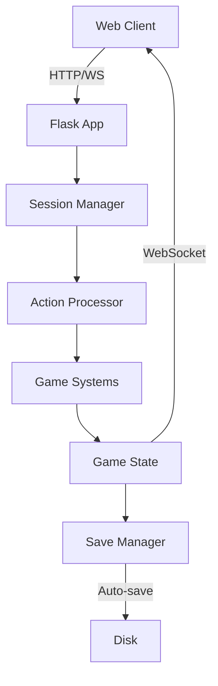

# Backend Components

The Python-based server components that power Cosmic Explorer's game engine and API.

## 🏗️ Architecture Overview

The backend is built with Flask and uses WebSocket for real-time communication:

```
api/
├── app.py                 # Flask application & API endpoints
├── action_processor.py    # Game action handling
├── session_manager.py     # Player session management
├── combat_system.py       # Combat mechanics
├── inventory_system.py    # Item management
├── pod_system.py         # Escape pod mechanics
└── ship_system.py        # Ship modifications

Core Game Files:
├── game.py               # Terminal game engine
├── regions.py            # Star map generation
├── navigation.py         # Movement logic
├── save_manager.py       # Persistence layer
└── config.py             # Game configuration
```

## 📋 Component List

### Core Server Components

#### [[api-server|API Server]] (app.py)
- Flask application with REST and WebSocket endpoints
- Handles all client-server communication
- Thread-safe session management
- Auto-save integration

#### [[action-processor|Action Processor]] (action_processor.py)
- Central game logic processor
- Handles all player actions
- Turn-based mechanics
- Event generation

#### [[session-manager|Session Manager]] (session_manager.py)
- Multi-session support
- Player state management
- Activity tracking
- Automatic cleanup

### Game Systems

#### [[combat-manager|Combat System]] (combat_system.py)
- Turn-based combat mechanics
- Enemy generation
- Damage calculation
- Loot rewards

#### [[inventory-manager|Inventory System]] (inventory_system.py)
- Item management
- Weight/capacity tracking
- Item usage logic
- Trading mechanics

#### [[ship-manager|Ship System]] (ship_system.py)
- Ship types and stats
- Modification system
- High/Mid/Low/Rig slots
- Stat calculations

#### [[pod-manager|Pod System]] (pod_system.py)
- Escape pod mechanics
- Augmentation system
- Emergency escape
- Risk/reward gameplay

### Support Components

#### [[save-manager|Save Manager]] (save_manager.py)
- Multi-slot saves
- Auto-save functionality
- Save migration
- Metadata tracking

#### [[game-engine|Game Engine]] (game.py)
- Core game loop
- Terminal interface
- State management
- Turn processing

## 🔄 Request Flow



## 🔌 API Endpoints

### Game Management
- `POST /api/game/new` - Start new game
- `GET /api/game/state/<session_id>` - Get game state
- `POST /api/game/action/<session_id>` - Perform action

### Save/Load
- `GET /api/saves` - List all saves
- `POST /api/saves/<slot>` - Save to slot
- `POST /api/load/<slot>` - Load from slot
- `DELETE /api/saves/<slot>` - Delete save

### Information
- `GET /api/game/ship_info/<session_id>` - Ship details
- `GET /api/game/inventory/<session_id>` - Inventory info
- `GET /api/game/navigation_options/<session_id>` - Movement options
- `GET /api/game/available_mods/<session_id>` - Available upgrades

## 💡 Key Features

### Thread Safety
- Global game lock for concurrent access
- Session-based isolation
- Safe WebSocket broadcasting

### Modularity
- Clear separation of concerns
- Each system handles its domain
- Easy to extend with new features

### State Management
- Centralized in SessionManager
- Consistent state updates
- WebSocket notifications

### Error Handling
- Graceful error responses
- Detailed error messages
- Client-friendly status codes

## 🔧 Configuration

Key settings in `config.py`:
- Game balance parameters
- Starting resources
- Victory conditions
- Save file locations
- Server settings

## 🚀 Running the Backend

```bash
# Direct execution
python api/app.py

# Using start script
./start_game.sh
```

The server runs on:
- HTTP: http://localhost:5000
- WebSocket: ws://localhost:5000

## 📚 Development Guide

### Adding New Actions
1. Add handler to `ActionProcessor`
2. Register in `action_handlers` dict
3. Implement game logic
4. Update client to send action

### Adding New Systems
1. Create system module
2. Import in `action_processor.py`
3. Add relevant actions
4. Update session state

### Testing
- Unit tests in `tests/`
- Manual testing via client
- WebSocket testing tools

## 🔍 Debugging

### Common Issues
- Session not found: Check session_id
- Lock timeout: Check for deadlocks
- State sync: Verify WebSocket connection

### Logging
- Flask debug mode for development
- Print statements for game events
- Client console for WebSocket

---

Parent: [[components/index|Components]] | [[README|Documentation Hub]]
