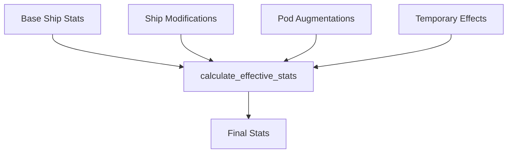

# Session Manager

Manages game sessions and player state for multiple concurrent players in Cosmic Explorer.

## 🎯 Overview

The Session Manager provides:
- Multi-session support for concurrent players
- In-memory state management
- Session persistence to disk
- Automatic cleanup of inactive sessions
- Activity tracking and timeouts
- State calculation with modifiers

## 🏗️ Architecture

### Two-Tier Structure

```python
SessionManager
├── sessions: Dict[str, GameSession]
├── max_sessions: 100
└── session_timeout: 3600 seconds

GameSession
├── session_id: str
├── player_stats: dict
├── star_map: dict
├── statistics: dict
└── game_state: various
```

## 📊 GameSession Class

### Core Properties

#### Player Statistics
```python
player_stats = {
    "health": 100,
    "wealth": 500,
    "ship_condition": 100,
    "fuel": 100,
    "food": 50,
    "has_flight_pod": False,
    "pod_hp": 0,
    "pod_augmentations": [],
    "in_pod_mode": False,
    
    # Ship system
    "ship_type": "scout",
    "ship_mods": {
        "high": [],
        "mid": [],
        "low": [],
        "rig": []
    },
    "inventory": [],
    "cargo_capacity": 50,
    
    # Effects
    "temp_effects": []
}
```

#### Game Progress
- `turn_count` - Current turn number
- `at_repair_location` - Can perform repairs
- `game_over` - Game ended flag
- `victory` - Victory achieved flag
- `current_event` - Active event type
- `available_choices` - Current options

#### Navigation State
- `star_map` - Generated universe
- `current_region_id` - Current region
- `current_node_id` - Current location

#### Statistics Tracking
```python
statistics = {
    "total_distance_traveled": 0,
    "systems_visited": 0,
    "items_collected": 0,
    "credits_earned": 0,
    "credits_spent": 0,
    "ships_destroyed": 0,
    "pod_uses": 0
}
```

### Key Methods

#### get_effective_stats()
Calculates final stats including:
- Base ship statistics
- Ship modifications
- Pod augmentations
- Temporary effects

```python
effective_stats = session.get_effective_stats()
# Returns merged stats with all bonuses applied
```

#### process_turn_effects()
Processes per-turn effects:
- Reduces effect durations
- Removes expired effects
- Applies hull repair
- Returns status messages

#### get_current_location()
Returns current location info:
```python
{
    "region": region_data,
    "node": node_data,
    "region_id": "region_123",
    "node_id": "node_456"
}
```

## 🔧 SessionManager Class

### Session Operations

#### Create Session
```python
session = manager.create_session(session_id, force_new=False)
```
- Creates new or retrieves existing
- Enforces session limit
- Initializes game state

#### Get Session
```python
session = manager.get_session(session_id)
```
- Returns existing session
- Returns None if not found

#### Remove Session
```python
manager.remove_session(session_id)
```
- Deletes session from memory
- No persistence

### Maintenance

#### Automatic Cleanup
```python
manager.cleanup_old_sessions()
```
- Runs periodically (5 min)
- Removes inactive > 1 hour
- Prevents memory leaks

#### Save All Sessions
```python
manager.save_all_sessions()
```
- Persists to disk
- Error handling per session
- Non-blocking failures

## 💾 Persistence

### Save Format
Sessions saved as JSON with minimal data:
```json
{
    "player_stats": {...},
    "active_quest": null,
    "completed_quests": [],
    "turn_count": 42,
    "at_repair_location": false,
    "star_map": {...},
    "current_region_id": "region_1",
    "current_node_id": "node_5",
    "statistics": {...}
}
```

### File Locations
- Pattern: `saves/session_{session_id}.json`
- Auto-created directories
- UTF-8 encoding

## 🔄 State Calculations

### Effective Stats Flow


### Cargo Space Management
- Calculated from inventory
- Weight-based system
- Real-time updates
- Capacity constraints

## 🚀 Session Lifecycle

1. **Creation**
   - New player joins
   - Initializes state
   - Generates star map

2. **Active**
   - Processes actions
   - Updates state
   - Tracks activity

3. **Inactive**
   - No actions
   - Timeout counting
   - Still in memory

4. **Cleanup**
   - Timeout exceeded
   - Removed from memory
   - Optional save

## 📈 Performance

### Memory Management
- 100 session limit
- ~10KB per session
- Automatic cleanup
- Lazy star map loading

### Concurrency
- Thread-safe with global lock
- No shared mutable state
- Session isolation

## 🔍 Debugging

### Session Statistics
```python
stats = manager.get_session_stats()
# Returns:
{
    "active_sessions": 5,
    "total_players": 5,
    "sessions": {
        "player1": {
            "turn_count": 42,
            "wealth": 2500,
            "game_over": False,
            "victory": False
        }
    }
}
```

### Common Issues
- **Session not found**: Timeout or restart
- **State mismatch**: Check effective stats
- **Save failures**: Disk permissions

## 📚 Best Practices

### Session Management
1. Use consistent session IDs
2. Handle missing sessions gracefully
3. Don't rely on session persistence
4. Validate state before actions

### State Updates
1. Always recalculate effective stats
2. Update activity timestamp
3. Process turn effects
4. Maintain stat consistency

### Error Handling
1. Catch save failures
2. Validate loaded data
3. Handle corrupt states
4. Log errors appropriately

---

Parent: [[backend/index|Backend Components]] | [[components/index|Components]]
Related: [[api-server|API Server]] | [[save-manager|Save Manager]] | [[ship-manager|Ship System]]
