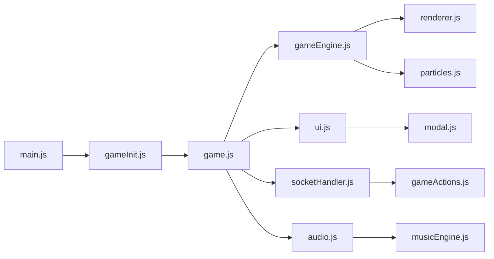

# Frontend Components

JavaScript-based client components that provide the user interface and game visualization for Cosmic Explorer.

## 🏗️ Architecture Overview

The frontend uses vanilla JavaScript with a modular architecture:

```
static/js/
├── game.js              # Main game controller
├── gameEngine.js        # Core game loop
├── gameInit.js          # Initialization logic
├── renderer.js          # Canvas rendering
├── ui.js               # UI management
├── particles.js        # Particle effects
├── audio.js            # Sound system
├── musicEngine.js      # Procedural music
├── combat.js           # Combat interface
├── podMods.js          # Pod mod visuals
├── main.js             # Entry point
├── config.js           # Client config
├── modules/            # Shared modules
│   ├── socketHandler.js
│   ├── gameActions.js
│   └── effectsManager.js
└── components/         # UI components
    └── modal.js
```

## 📋 Component List

### Core Components

#### [[game-controller|Game Controller]] (game.js)
- Main game state management
- Action coordination
- Server communication
- Update distribution

#### [[game-engine|Game Engine]] (gameEngine.js)
- Game loop implementation
- Frame timing
- Update cycles
- Render pipeline

#### [[rendering-engine|Rendering Engine]] (renderer.js)
- Canvas-based graphics
- Sprite rendering
- UI overlay
- Visual effects

### UI Components

#### [[ui-system|UI System]] (ui.js)
- HUD management
- Modal dialogs
- Save/load interface
- Inventory display

#### [[modal-system|Modal System]] (components/modal.js)
- Reusable modal component
- Event handling
- State management
- Animations

### Visual Effects

#### [[particle-system|Particle System]] (particles.js)
- Space dust effects
- Explosions
- Engine trails
- Environmental effects

#### [[effects-manager|Effects Manager]] (modules/effectsManager.js)
- Combat animations
- Damage indicators
- Transitions
- Screen effects

### Audio Components

#### [[audio-system|Audio System]] (audio.js)
- Sound effect playback
- Volume control
- Audio pooling
- 3D positioning

#### [[music-engine|Music Engine]] (musicEngine.js)
- Procedural generation
- Dynamic adaptation
- Mood-based selection
- Seamless transitions

### Networking

#### [[websocket-client|WebSocket Client]] (modules/socketHandler.js)
- Real-time communication
- Event handling
- Reconnection logic
- State synchronization

#### [[game-actions|Game Actions]] (modules/gameActions.js)
- Action requests
- Response handling
- Optimistic updates
- Error recovery

## 🎮 Component Interactions



## 🖼️ Rendering Pipeline

### Canvas Layers
1. **Background** - Stars and space
2. **Game Objects** - Ships, stations
3. **Effects** - Particles, explosions
4. **UI Overlay** - HUD elements
5. **Modals** - Dialog boxes

### Render Cycle
1. Clear canvas
2. Update camera position
3. Render background
4. Render game objects
5. Update particles
6. Draw UI elements
7. Present frame

## 🎨 UI Architecture

### Component System
- Event-driven updates
- State synchronization
- Responsive design
- Keyboard shortcuts

### Modal Framework
```javascript
showModal({
    title: "Save Game",
    content: saveContent,
    buttons: [
        { text: "Save", class: "primary", onclick: save },
        { text: "Cancel", onclick: close }
    ]
});
```

## 🔊 Audio Architecture

### Sound Categories
- **UI** - Clicks, notifications
- **Combat** - Weapons, explosions
- **Ambient** - Engine, space
- **Music** - Dynamic soundtrack

### Music System
- Procedural generation
- Context-aware adaptation
- Smooth transitions
- Performance optimized

## 🔌 Network Communication

### WebSocket Protocol
```javascript
// Send action
socket.emit('action', {
    action: 'navigate',
    target: 'node_123'
});

// Receive update
socket.on('game_state', (state) => {
    updateGame(state);
});
```

### Event Types
- `game_state` - Full state update
- `game_event` - Event notification
- `combat_update` - Combat state
- `error` - Error messages

## ⚡ Performance

### Optimization Techniques
- Object pooling for particles
- Dirty rectangle rendering
- Request animation frame
- Debounced UI updates
- Lazy asset loading

### Target Metrics
- 60 FPS gameplay
- < 50ms input latency
- < 100ms server response
- < 5MB memory footprint

## 🎮 Input Handling

### Keyboard Shortcuts
- `W/A/S/D` - Navigation
- `Space` - Action
- `I` - Inventory
- `F5` - Quick save
- `F9` - Quick load
- `Esc` - Close modal

### Mouse/Touch
- Click navigation
- Hover tooltips
- Touch gestures
- Responsive UI

## 🔧 Configuration

Client settings in `config.js`:
- Canvas dimensions
- Particle counts
- Sound volumes
- Network timeouts
- Debug flags

## 🚀 Development

### Adding Components
1. Create module file
2. Export public interface
3. Import in game.js
4. Initialize in gameInit
5. Update documentation

### Testing
- Browser console debugging
- Network traffic inspection
- Performance profiling
- Visual regression tests

---

Parent: [[components/index|Components]] | [[README|Documentation Hub]]
Related: [[backend/index|Backend Components]] | [[game-systems/index|Game Systems]]
