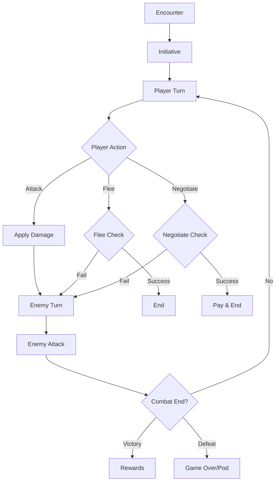

# Combat System

Turn-based space combat with tactical choices, diverse enemies, and risk/reward mechanics.

## ⚔️ Overview

The combat system provides:
- Turn-based tactical combat
- Multiple enemy types with unique behaviors
- Combat actions based on equipment
- Loot and reward mechanics
- Flee and negotiation options
- Dynamic difficulty based on location

## 🎯 Combat Flow



## 👾 Enemy Types

### Pirate Scout 🏴‍☠️
- **HP**: 30
- **Power**: 5
- **Speed**: 1.2
- **Accuracy**: 70%
- **Behavior**: Flees at 30% HP
- **Loot**: Basic materials
- **Reward**: 50-100 credits

### Pirate Raider ☠️
- **HP**: 60
- **Power**: 12
- **Speed**: 1.0
- **Accuracy**: 75%
- **Behavior**: Flees at 20% HP
- **Loot**: Good variety
- **Reward**: 100-200 credits

### Alien Defense Drone 🤖
- **HP**: 45
- **Power**: 10
- **Speed**: 0.8
- **Accuracy**: 85%
- **Behavior**: Never flees, can't negotiate
- **Loot**: Tech components
- **Reward**: No credits

### Space Kraken 🐙
- **HP**: 100
- **Power**: 20
- **Speed**: 0.6
- **Accuracy**: 60%
- **Behavior**: Rare, powerful
- **Loot**: Exotic materials
- **Reward**: 200-400 credits

### Rogue AI Warship 🖥️
- **HP**: 80
- **Power**: 15
- **Speed**: 1.1
- **Accuracy**: 90%
- **Behavior**: Never flees, can't negotiate
- **Loot**: Advanced tech
- **Reward**: 150-300 credits

## ⚡ Combat Actions

### Basic Actions

#### Attack
- Standard weapon fire
- No modifiers
- Always available

#### Evasive Maneuvers
- 2x defense modifier
- 0.5x accuracy
- 0.5x damage
- Always available

### Equipment-Based Actions

#### Precise Shot
- **Requires**: Targeting Computer
- 1.5x accuracy
- 0.8x damage
- 1.2x defense

#### Barrage
- **Requires**: 2+ weapons
- 0.7x accuracy
- 1.5x damage
- 0.8x defense

## 🎲 Combat Mechanics

### Damage Calculation
```
Base Damage = Combat Power ± Random(2-3)
Final Damage = Base Damage × Action Modifier × Equipment Bonuses
```

### Accuracy Formula
```
Hit Chance = Base Accuracy × Action Modifier × Equipment Bonuses
Enemy Hit = Enemy Accuracy ÷ (Player Speed × Defense Modifier)
```

### Equipment Effects
- **Laser Cannon**: +5 combat power
- **Missile Launcher**: +8 combat power
- **Targeting Computer**: +20% accuracy
- **Afterburner**: +30% speed
- **Shield Booster**: Damage reduction

## 💰 Reward System

### Credit Rewards
- Based on enemy type
- Random within range
- No credits from drones

### Loot Tables
Each enemy has specific loot:
- **Drop Chance**: 80-100%
- **Item Types**: Based on enemy
- **Quantities**: Varies by item
- **Cargo Check**: Must have space

### Common Loot
- `scrap_metal` - Basic salvage
- `fuel_cells` - Emergency fuel
- `rare_minerals` - Valuable ore
- `data_cores` - Information
- `quantum_processor` - Advanced tech
- `exotic_matter` - Rare material

## 🏃 Escape Mechanics

### Flee Attempt
```
Flee Chance = Player Speed ÷ (Enemy Speed × 1.5)
Max Chance = 90%
Fuel Cost = 10 extra
```

Failed flee = Enemy gets bonus attack (1.5x damage)

### Speed Modifiers
- Ship type base speed
- Afterburner: +30%
- Ship condition affects speed

## 💬 Negotiation System

### Requirements
- Enemy must be sentient (no drones/AI)
- Must have sufficient credits
- Cost based on enemy strength

### Cost Calculation
```
Base Cost = Enemy Max Reward
HP Modifier = Current HP ÷ Max HP
Final Cost = Base Cost × HP Modifier
```

### Success Rate
```
Base Chance = 30%
HP Bonus = (1 - HP%) × 50%
Total = Base + Bonus
```

## 🎮 Encounter Generation

### Danger-Based Spawning
Enemy selection weighted by:
- Location danger level
- Specific location types
- Player progression

### Location Modifiers
- **Ancient Ruins**: More drones
- **Nebula**: Space krakens
- **Asteroid Fields**: Pirates
- **Deep Space**: AI ships

## 🛡️ Player Combat Stats

### Base Values
- Accuracy: 70%
- Speed: 1.0 (ship-dependent)
- Power: Sum of weapons

### Equipment Bonuses
Applied before action modifiers:
- Targeting Computer: +20% accuracy
- Afterburner: +30% speed
- Multiple weapons stack power

## 📊 Combat State

The combat state tracks:
```javascript
{
    player_hp: 85,
    player_max_hp: 100,
    enemy_hp: 45,
    enemy_max_hp: 60,
    enemy_type: "pirate_raider",
    enemy_data: {...},
    turn: 3,
    available_actions: ["attack", "precise_shot", "evasive"]
}
```

## 🔧 Integration Points

### Action Processor
- Handles combat initiation
- Processes combat actions
- Manages state transitions

### UI System
- Displays combat interface
- Shows health bars
- Lists available actions

### Inventory System
- Checks cargo space for loot
- Adds rewards to inventory
- Validates item additions

## 🎯 Strategy Tips

### Equipment Priorities
1. Get at least one weapon upgrade
2. Targeting Computer for accuracy
3. Afterburner for fleeing
4. Shield Booster for survival

### Combat Tactics
- Use Precise Shot vs high-HP enemies
- Barrage for quick kills
- Evasive when low HP
- Flee from overwhelming odds

### Economic Decisions
- Negotiate when wealthy
- Fight weak enemies for loot
- Flee costs fuel but saves repairs

---

Parent: [[game-systems/index|Game Systems]] | [[components/index|Components]]
Related: [[action-processor|Action Processor]] | [[inventory-system|Inventory System]]
