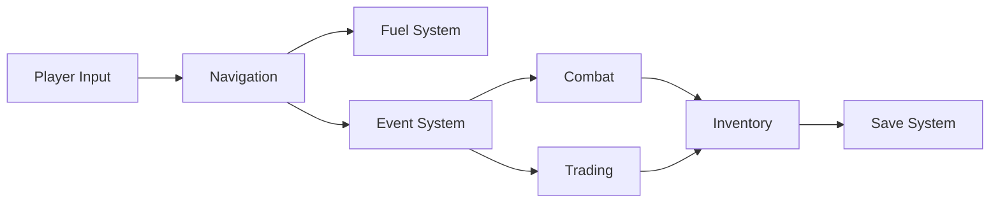

# Game Systems Documentation

Core gameplay mechanics and systems that power Cosmic Explorer.

## 📋 System Categories

### ⚔️ Combat Systems
- [[combat-system|Combat Mechanics]] - Ship battles and damage calculation
- [[weapons-and-shields|Weapons & Shields]] - Equipment and defensive systems

### 🚀 Navigation & Movement
- [[navigation-system|Navigation System]] - Region traversal and pathfinding
- [[fuel-system|Fuel Management]] - Resource consumption and efficiency

### 💰 Economy & Trading
- [[trading-system|Trading System]] - Buy/sell mechanics and pricing
- [[economy-balance|Economic Balance]] - Wealth generation and sinks

### 📦 Inventory & Equipment
- [[inventory-system|Inventory Management]] - Item storage and weight limits
- [[ship-modifications|Ship Modifications]] - High/Mid/Low/Rig slot system

### 🛡️ Pod Systems
- [[pod-augmentations|Pod Augmentation System]] - Upgradeable escape pod
- [[pod-mechanics|Pod Escape Mechanics]] - Emergency escape functionality

### 🎯 Quest & Events
- [[quest-system|Quest System]] - Mission tracking and rewards
- [[event-system|Random Events]] - Encounters and discoveries

### 💾 Persistence
- [[save-system|Save/Load System]] - Game state persistence
- [[autosave|Auto-save Functionality]] - Automatic progress protection

### 🎵 Audio & Visual
- [[music-engine|Procedural Music Engine]] - Dynamic soundtrack generation
- [[particle-effects|Particle Effects System]] - Visual feedback and ambiance

## 🔧 System Integration

### Data Flow Between Systems

### System Dependencies
- All systems depend on the [[components/backend/game-engine|Game Engine]]
- UI systems depend on [[components/frontend/ui-system|UI Manager]]
- Persistence relies on [[save-system|Save System]]

## 📊 System Status

| System | Implementation | Documentation | Test Coverage |
|--------|---------------|---------------|---------------|
| Combat | ✅ Complete | ✅ Full | 🟡 Basic |
| Navigation | ✅ Complete | ✅ Full | ✅ Good |
| Trading | ✅ Complete | 🟡 Partial | 🟡 Basic |
| Inventory | ✅ Complete | ✅ Full | ✅ Good |
| Pod Augmentations | ✅ Complete | ✅ Full | 🟡 Basic |
| Quests | 🟡 Basic | 🔴 Minimal | 🔴 None |
| Save/Load | ✅ Complete | ✅ Full | ✅ Good |
| Music Engine | ✅ Complete | 🟡 Partial | 🔴 None |

## 🎮 Gameplay Loop

1. **Exploration Phase**
   - Navigate between regions
   - Consume fuel resources
   - Discover new locations

2. **Encounter Phase**
   - Random events trigger
   - Combat or trading opportunities
   - Quest progression

3. **Management Phase**
   - Inventory optimization
   - Ship upgrades
   - Resource planning

4. **Progression Phase**
   - Complete quests
   - Unlock new regions
   - Upgrade capabilities

## 🔍 Common Patterns

### Resource Management
All consumable resources follow similar patterns:
- Maximum capacity limits
- Consumption rates
- Replenishment methods
- UI feedback

### Risk/Reward Mechanics
Systems encourage strategic decisions:
- Pod augmentations lost on use
- Dangerous regions offer better rewards
- Trade-offs between safety and profit

### Progression Systems
Multiple advancement paths:
- Ship upgrades (permanent)
- Pod augmentations (temporary)
- Wealth accumulation
- Regional unlocks

## 📚 Related Documentation

- [[architecture/overview|System Architecture]]
- [[references/game-mechanics|Detailed Mechanics Reference]]
- [[guides/development/adding-systems|Adding New Game Systems]]
- [[components/backend/index|Backend Components]]

---

Parent: [[components/index|Components]] | [[README|Documentation Hub]]
