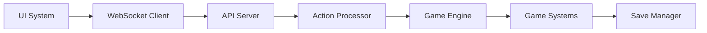
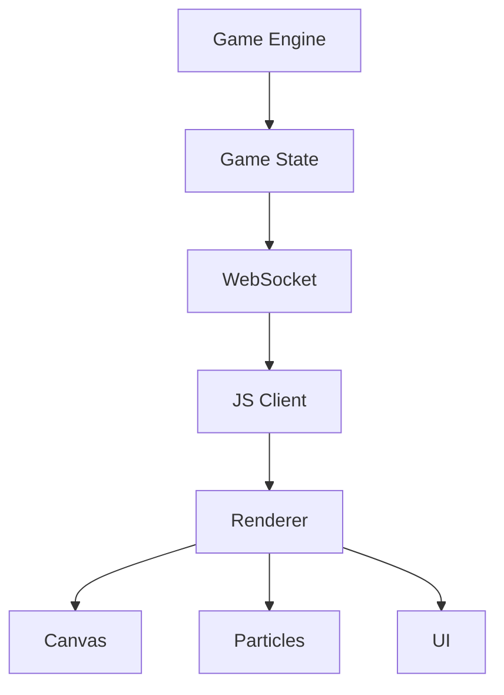

# Components Documentation

Technical documentation for all system components in Cosmic Explorer.

## 🔧 Component Categories

### [[backend/index|Backend Components]]
Python-based server and game engine components:
- [[backend/game-engine|Game Engine]] - Core game logic
- [[backend/api-server|API Server]] - Flask REST/WebSocket server
- [[backend/action-processor|Action Processor]] - Game command handling
- [[backend/session-manager|Session Manager]] - Player session tracking
- [[backend/save-manager|Save Manager]] - Persistence layer

### [[frontend/index|Frontend Components]]
JavaScript-based client components:
- [[frontend/rendering-engine|Rendering Engine]] - Canvas-based graphics
- [[frontend/ui-system|UI System]] - Modal and HUD management
- [[frontend/particle-system|Particle System]] - Visual effects
- [[frontend/audio-system|Audio System]] - Sound and music
- [[frontend/websocket-client|WebSocket Client]] - Server communication

### [[game-systems/index|Game Systems]]
Core gameplay mechanics:
- [[game-systems/combat-system|Combat System]] - Battle mechanics
- [[game-systems/navigation-system|Navigation System]] - Movement and travel
- [[game-systems/trading-system|Trading System]] - Economy mechanics
- [[game-systems/pod-augmentations|Pod Augmentations]] - Upgrade system
- [[game-systems/save-system|Save System]] - Game persistence

## 📊 Component Overview

### Backend Architecture
```
api/
├── app.py              # Main Flask application
├── action_processor.py # Game action handling
├── combat_system.py    # Combat mechanics
├── inventory_system.py # Inventory management
├── pod_system.py       # Pod augmentations
├── session_manager.py  # Player sessions
└── ship_system.py      # Ship modifications
```

### Frontend Architecture
```
static/js/
├── game.js             # Main game client
├── renderer.js         # Canvas rendering
├── ui.js              # UI management
├── particles.js       # Particle effects
├── audio.js           # Sound system
├── combat.js          # Combat UI
└── modules/           # Shared modules
```

## 🔗 Component Interactions

### Request Flow


### Rendering Pipeline


## 🛠️ Working with Components

### Adding New Components
1. Identify component category (backend/frontend/game-system)
2. Follow existing patterns in that category
3. Document interfaces and dependencies
4. Write tests for new functionality
5. Update relevant documentation

### Component Guidelines
- **Single Responsibility**: Each component has one clear purpose
- **Loose Coupling**: Minimize dependencies between components
- **Clear Interfaces**: Well-defined APIs between components
- **Documentation**: Every component must be documented
- **Testing**: Components should have unit tests

## 📋 Component Status

### Fully Implemented ✅
- Game Engine
- Combat System
- Navigation System
- Save System
- UI System
- Particle Effects

### Partially Implemented 🚧
- Star Map (needs interactivity)
- Audio System (missing sound effects)
- Quest System (basic only)

### Planned 📅
- Multiplayer System
- Mod Support System
- Achievement System

## 🔍 Finding Components

### By Function
- **Game Logic**: See [[game-systems/index|Game Systems]]
- **User Interface**: See [[frontend/index|Frontend Components]]
- **Server/API**: See [[backend/index|Backend Components]]

### By Technology
- **Python**: All [[backend/index|backend components]]
- **JavaScript**: All [[frontend/index|frontend components]]
- **WebSocket**: [[backend/api-server|API Server]], [[frontend/websocket-client|WebSocket Client]]

---

Parent: [[README|Documentation Hub]]
